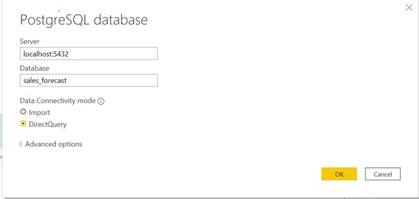

#### Data Engineering Processing
* Choice of Tools
  * PostgreSQL
  * PowerBI
  * SAS
* Data Wrangling
  * Translation (Russian to English)
  * Quality evaluation
* ETL    
  * Import data to PostgreSQL
  * Connect PostgreSQL to PowerBI for visualization in EDA
    

#### Data Analytic 
* Exploratory Data Analysis
* Model Training
* Submission

#### Background
* Historical sales data downloaded from [Kaggle](https://www.kaggle.com/c/competitive-data-science-predict-future-sales/data).
  * Russian software firms - [1C Company](https://1c.ru/eng/title.htm).
* Objective: forecast the quantity of products sold in every shop for the coming month
* Challenge:
  * Large time-series datasets (**3,000,000** transaction records)
  * list of shops and products slightly changes every month. 
    
#### File descriptions
| Name | Size | Desc |
| --- | ---| ---|
| sales_train.csv| 90.2 MB| training dataset (**3,000,000** transaction records)|
| test.csv| 3.03 MB| testing dataset |
| items.csv| 1.49 MB| supplemental information about the items/products|
| item_categories.csv|  | supplemental information about the items categories|
| shops.csv|  | supplemental information about the shops|

#### Data fields descriptions
| Name | Desc |
| --- | ---|
| id | Id that represents a (Shop, Item) tuple within the test set| ---|
| shop_id  | unique identifier of a shop|
| item_id | unique identifier of a product|
| item_category_id | unique identifier of item category|
| **item_cnt_day** | number of products sold per day|
| item_price | current price of an item|
| date | date in format dd/mm/yyyy |
| date_block_num | a consecutive month number for sorting date |
| item_name | name of item |
| shop_name | name of shop |
| item_category_name | name of item category |
